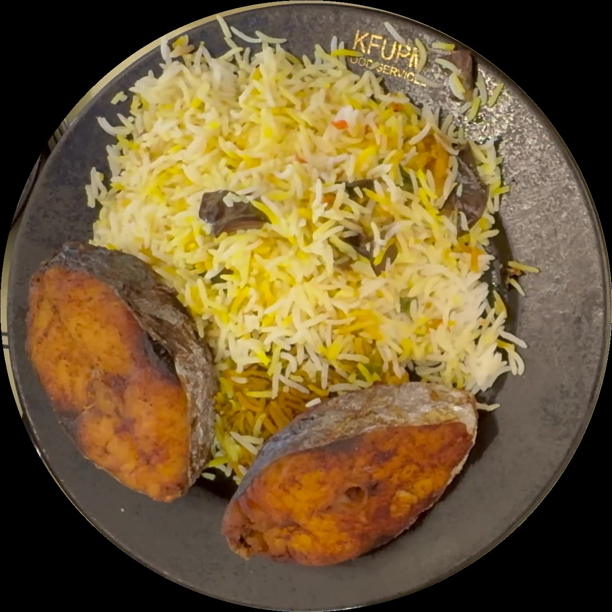
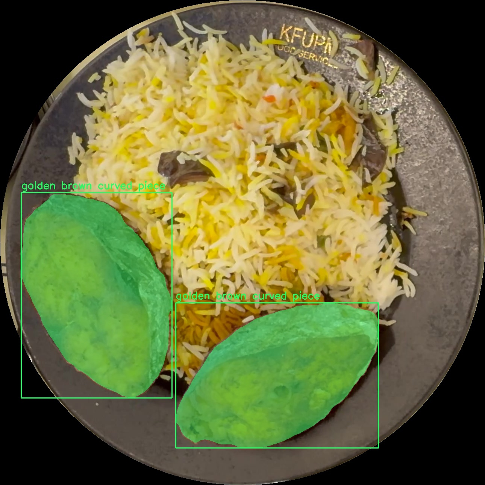
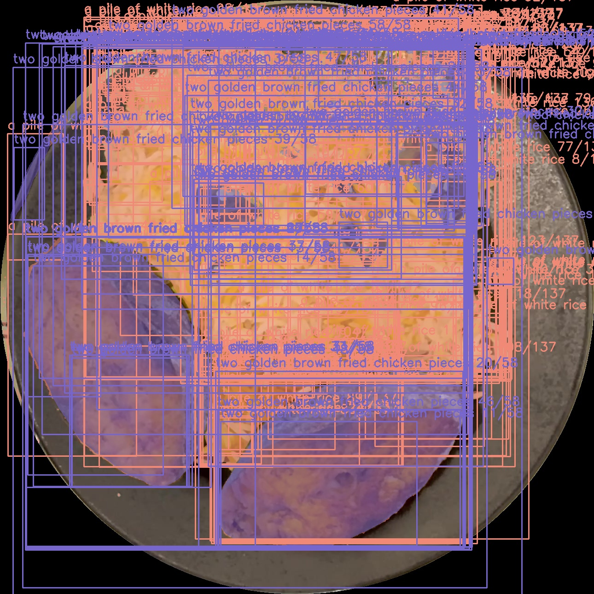
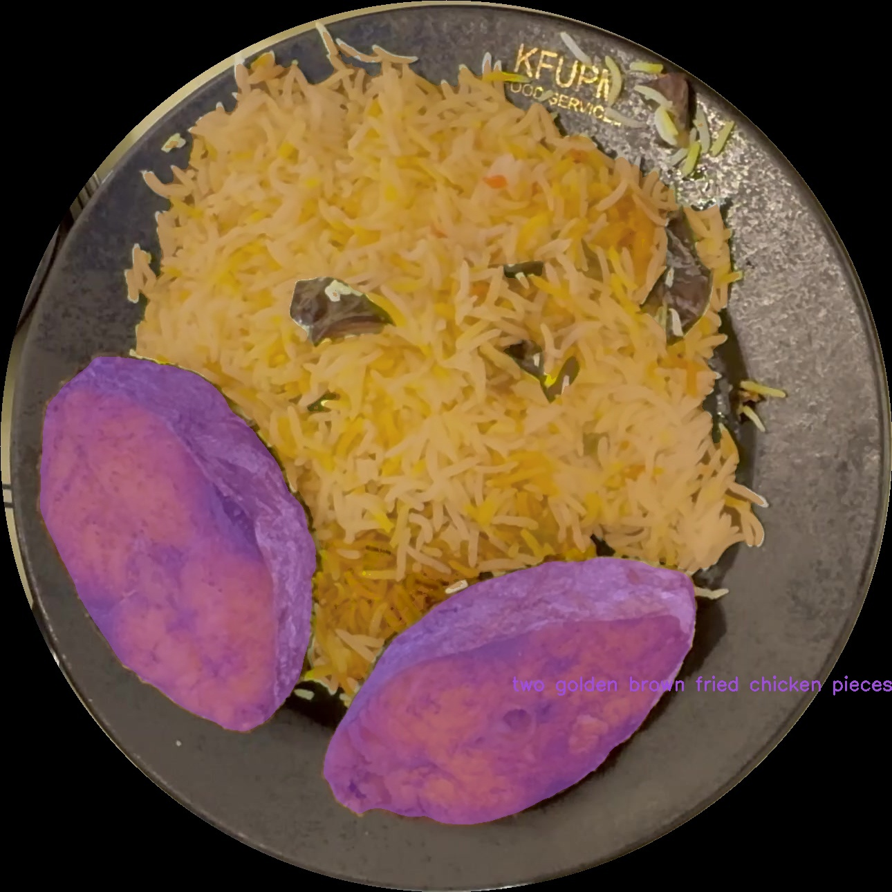
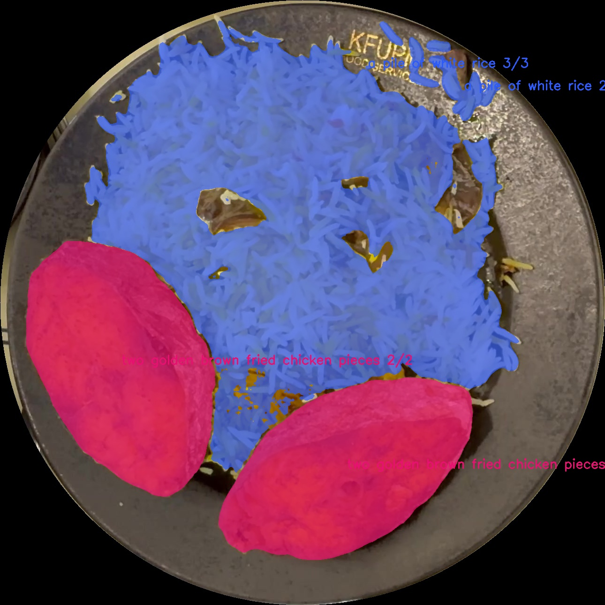
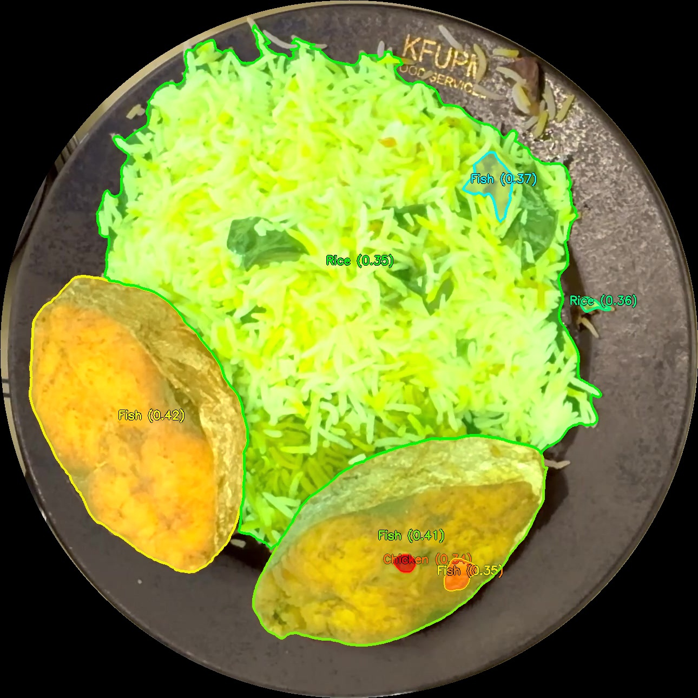

# 🍴 Intelligent Food Analysis & Segmentation Showcase

This repository documents the evolution of specialized food recognition technology, transitioning from few-shot classification to advanced multimodal reasoning.

[](experiments/v2_sam3_qwen_vl/)

---

## 🏆 The Evolution of the Pipeline

We present two distinct generations of our food analysis engine. While both achieve high-quality results, the transition to V2 represents a paradigm shift in how AI understands culinary scenes.

| Feature | **V1: Hybrid Classification** | **V2: Multimodal Reasoning** |
| :--- | :--- | :--- |
| **Logic** | Few-shot comparison against refs | Zero-shot visual reasoning |
| **Models** | FoodSAM + PictSure | **Qwen2.5-VL + SAM3** |
| **Context** | Required manually provided context images | Understands scene context natively |
| **Thresholding** | Fixed confidence scores | **Dynamic Auto-Retry Logic** |
| **Precision** | Standard segmentation | **Global NMS** (Overlapping detection fix) |

---

## 🔬 Experiment V2: SAM3 + Qwen-VL (State of the Art)

The current production-grade pipeline uses **Qwen2.5-VL-3B** for reasoning and **SAM3** for precise pixel-level masking. It was developed through 6 rigorous experimental iterations to reach peak performance.

### 🖼️ The 6-Run Innovation Gallery
We meticulously refined the pipeline through these major phases:

| Run 1: Baseline | Run 2: Visual Descriptions | Run 3: Instance Counting |
| :---: | :---: | :---: |
|  |  |  |
| *Semantic Prompts* | *Color/Shape Prompts* | *High Recall (0.01)* |

| Run 4: Precision (NMS) | Run 5: Aesthetic Polish | Run 6: Final (Dynamic) |
| :---: | :---: | :---: |
|  |  |  |
| *No Ghosting* | *Bold Visuals (4px)* | *Guaranteed Detection* |

👉 **[Explore V2 Code & Guide](./experiments/v2_sam3_qwen_vl/)**

---

## 🥗 Experiment V1: FoodSAM + PictSure (Legacy)

Our first successful iteration utilized a hybrid approach combining semantic experts with a few-shot learner. While effective, it required high-quality reference "context" images to function.

<p align="center">
  
  
</p>

👉 **[Explore V1 Legacy Code](./experiments/v1_hybrid_foodsam_pictsure/)**

---

## 🛠️ Quick Start (V2)

1. **Setup Environment**:
   ```bash
   pip install -r experiments/v2_sam3_qwen_vl/requirements.txt
   ```
2. **Run Inference**:
   ```bash
   python experiments/v2_sam3_qwen_vl/main.py "/path/to/images" --output_dir "./results"
   ```

Check the [V2 Reproduction Guide](experiments/v2_sam3_qwen_vl/REPRODUCTION_GUIDE.md) for full hardware requirements and troubleshooting.

---
**Developed by Antigravity**
