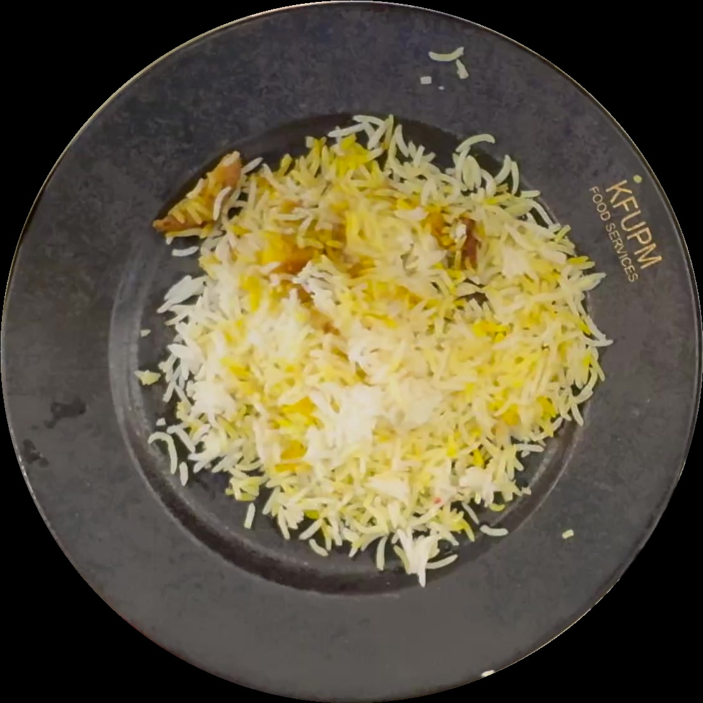
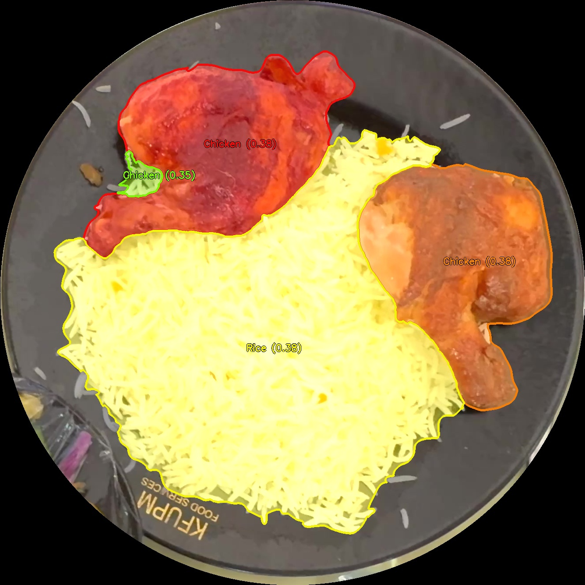

# 🥗 Hybrid FoodSAM-PictSure Analysis Pipeline

> **"Best of Both Worlds"**: Combining high-fidelity semantic segmentation with targeted in-context learning for precise food analysis.


## 🚀 Overview

This pipeline integrates **FoodSAM** (Segment Anything Model + Semantic Experts) with **PictSure** (In-Context Few-Shot Learner) to solve complex food recognition tasks.

### The Architecture
1.  **Segmentation (FoodSAM)**: Generates high-quality candidate masks, filtering out plates, utensils, and background noise.
2.  **Targeted Classification (PictSure)**: A few-shot Vision Transformer classifies specific food items (e.g., *Chicken, Fish, Rice*) by comparing them against a set of context images.
3.  **Visual Discovery**: Uses a greedy multi-color discovery algorithm to visualize every distinct food item with neon overlays and shadow-text labels.

## 🖼️ Context Images

These reference images are used by the PictSure model for in-context learning to identify specific food items.

<p align="center">
  
  
  
</p>

## 📂 Project Structure

```
KFUPMRestaurant/
├── assets/
│   ├── context/          # Reference images for PictSure in-context learning
│   │   ├── CHICKEN.jpg
│   │   ├── FISH.jpg
│   │   └── RICE.jpg
│   └── results/          # Pipeline output visualizations
│       ├── mixed_1_hybrid_vis.jpg
│       ├── mixed_2.jpg
│       ├── mixed_3_hybrid_vis.jpg
│       └── mixed_4_hybrid_vis.jpg
├── src/
└── README.md

```

## 🛠️ Installation

1.  **Clone the repository**:
    ```bash
    git clone https://github.com/yourusername/food-analysis-pipeline.git
    cd food-analysis-pipeline
    ```

2.  **Install Dependencies**:
    ```bash
    pip install -r requirements.txt
    ```
    *Note: You may need to install `PictSure` separately if you haven't already.*

3.  **Environment Setup**:
    Ensure you have `HF_TOKEN` set if using private HuggingFace models:
    ```bash
    export HF_TOKEN="your_token_here"  # Linux/Mac
    set HF_TOKEN="your_token_here"     # Windows
    ```

## 💻 Usage

Run the pipeline on a directory of FoodSAM outputs:

```bash
python src/pipeline.py \
    --input_dir /path/to/foodsam/outputs \
    --output_dir results/ \
    --device cuda
```

### Arguments
| Argument | Description | Default |
|---|---|---|
| `--input_dir` | Directory containing subfolders with `input.jpg` and `enhance_mask.png` | **Required** |
| `--output_dir` | Where to save the visualized hybrid results | `results` |
| `--device` | Inference device (`cuda` or `cpu`) | `cuda` |
| `--assets_dir` | Location of context images and assets | `../assets` |

## 📊 Results

The pipeline produces high-contrast, aesthetically pleasing visualizations where each food segment is isolated, classified, and overlaid with a unique vibrant color.

| Input (Original Video Frame) | Hybrid Output (FoodSAM + PictSure) |
| :---: | :---: |
| *Mixed Food Platter 1* |  |
| *Mixed Food Platter 2* |  |
| *Mixed Food Platter 3* |  |
| *Mixed Food Platter 4* |  |

---
**Status**: 🟢 Fully Functional  
**Python**: 3.9+  
**License**: MIT


