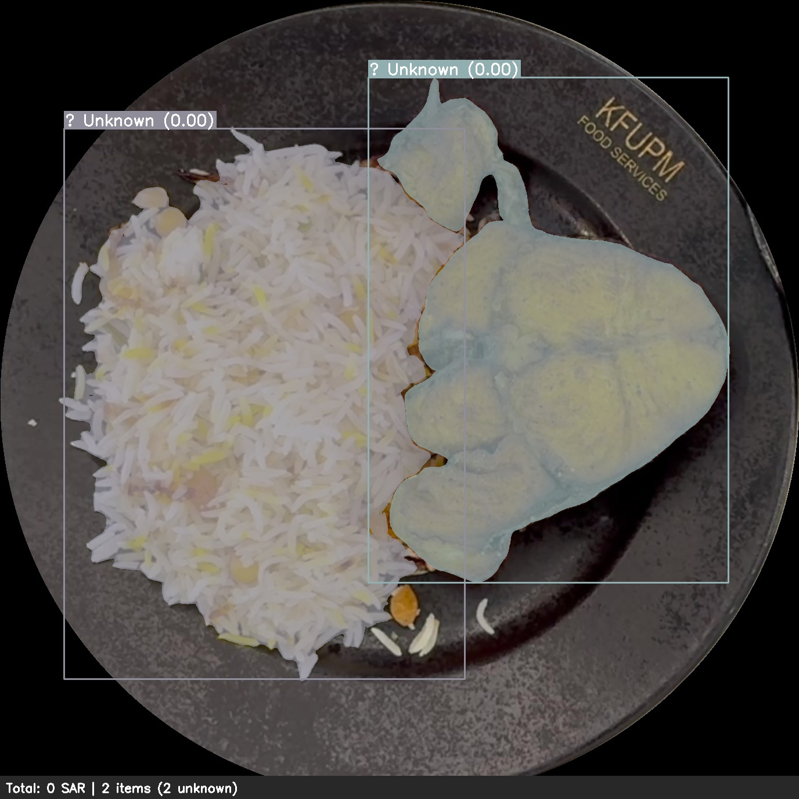
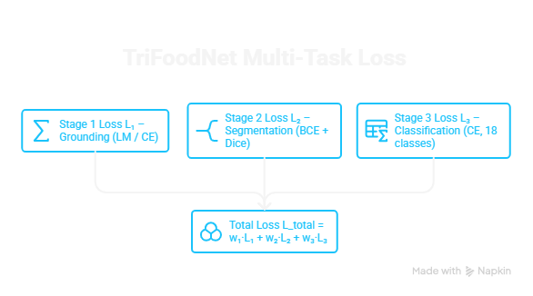
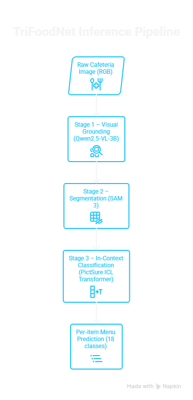
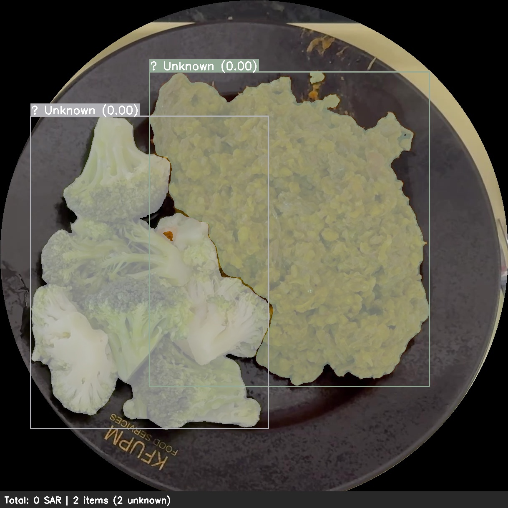
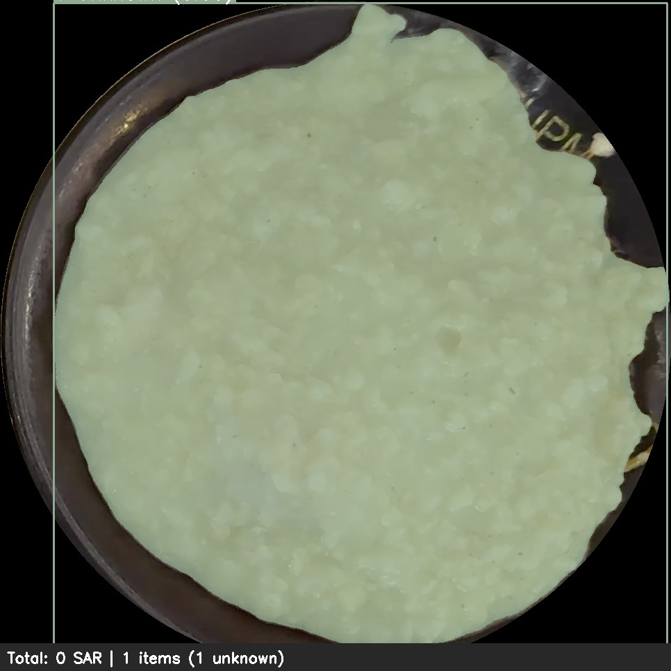
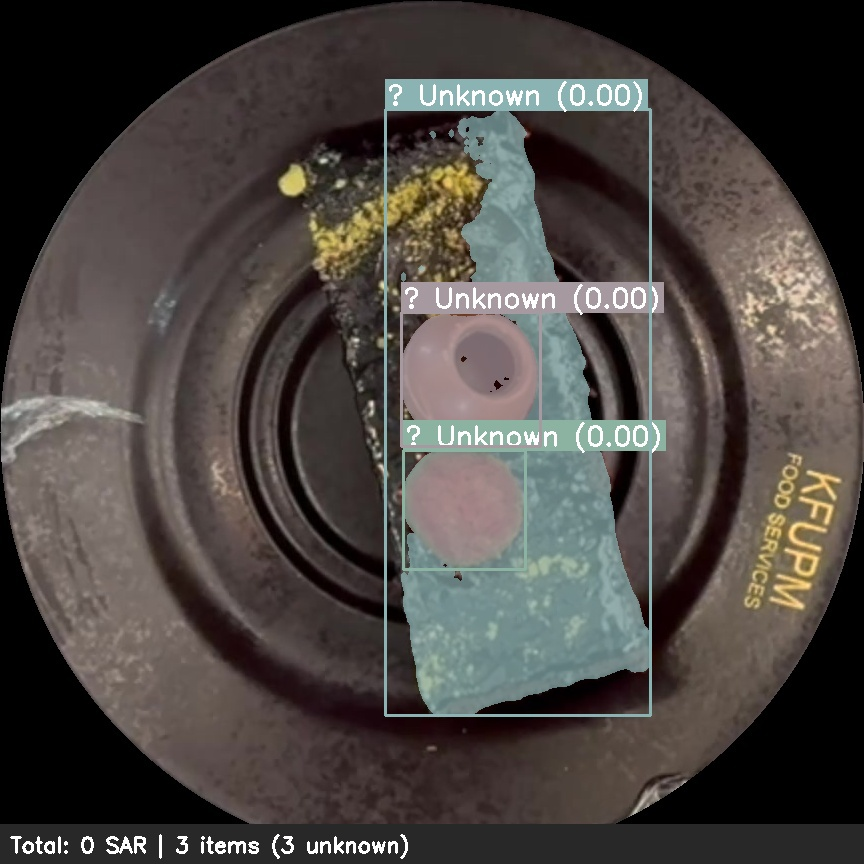
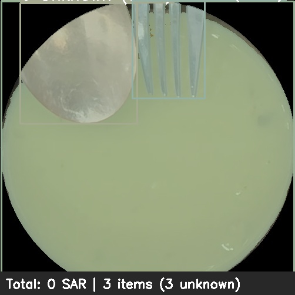
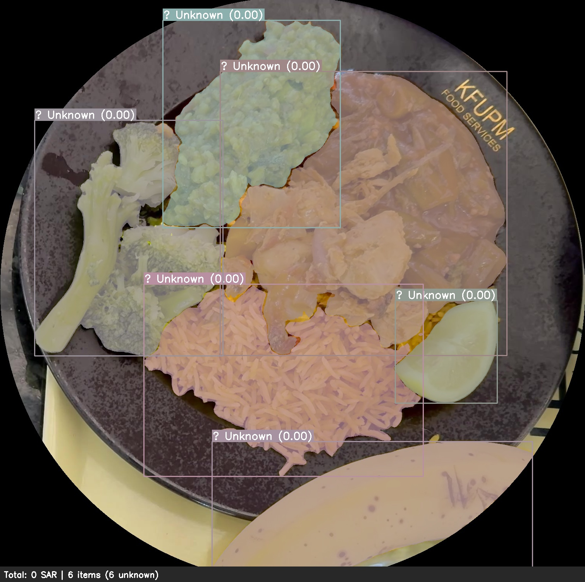

# Intelligent Food Analysis, Segmentation, and TriFoodNet Research

This repository is now organized as a documentation-first review package.

Its main purpose is to present the V3 `TriFoodNet` research line clearly:

- what the model is
- what assumptions it makes
- what the latest retained evidence shows
- where to read the detailed markdown documentation

Older V1 and V2 work is still preserved, but it is no longer the main story on
the front page.

## Start Here

If you are reviewing the project for research quality, read these in order:

1. [V3 TriFoodNet Snapshot README](./experiments/v3_trifoodnet_research_snapshot/README.md)
2. [Faculty Review Guide](./experiments/v3_trifoodnet_research_snapshot/docs/FACULTY_REVIEW_GUIDE.md)
3. [All Trials Report](./experiments/v3_trifoodnet_research_snapshot/outputs/all_trials_report_20260321/index.md)
4. [Best Run Summary](./experiments/v3_trifoodnet_research_snapshot/outputs/trial-20260321-cleandata1/report_metrics/RESULTS_SUMMARY.md)
5. [Batch8 Dataset Note](./experiments/v3_trifoodnet_research_snapshot/BATCH8_DATASET_NOTE.md)

## Main Track

The active research track is:

- [experiments/v3_trifoodnet_research_snapshot](./experiments/v3_trifoodnet_research_snapshot/)

This track preserves:

- the three-stage training and inference code
- retained experiment logs and reports
- a faculty-facing review path
- architecture and loss diagrams
- representative V3 image outputs

## Model Summary

TriFoodNet is a staged food-understanding pipeline:

1. Stage 1 uses `Qwen2.5-VL` to ground food items in the full tray image.
2. Stage 2 uses `SAM` to convert grounded boxes into masks.
3. Stage 3 classifies masked item crops with a specialist classifier.

The main design claim is not that one stage solves everything. The system is
intentionally decomposed so that detection, segmentation, and item recognition
can be inspected separately.

## Current Research Direction

The best retained run still used a partially trainable Stage 2 setup:

- SAM image encoder frozen
- SAM prompt encoder frozen
- SAM mask decoder trainable

The current next-step hypothesis is to freeze SAM fully and keep optimization
pressure on Stage 1 and Stage 3. That should be read as a research direction,
not as a completed empirical result.

## Core Assumptions

The V3 pipeline is built around these assumptions:

- the input is a cafeteria-style tray image with one or more visible food items
- Stage 1 can provide useful candidate boxes before segmentation is attempted
- Stage 2 is mainly a structured mask generator, not the primary novelty source
- Stage 3 depends on reasonably aligned masked crops from earlier stages
- reproducibility currently depends on restoring external dataset assets
- the public GitHub copy is a review package, not a fully self-contained
  benchmark release

## Latest Retained Results

These are the latest retained numbers for the strongest run currently preserved
in the repo.

| Item | Value |
| --- | --- |
| Strongest retained run | `trial-20260321-cleandata1` |
| Best retained checkpoint | `epoch_038` by `joint/combined = 1.9375961198969618` |
| Final retained epoch | `epoch_040` |
| Final dev Stage 1 recall@0.5 | `0.8636363636363636` |
| Final dev Stage 2 mIoU | `0.5733921838932934` |
| Final dev Stage 3 accuracy | `0.5` |
| Final dev combined score | `1.937028547529657` |
| Runs compared in retained report | `15` |

## Architecture References

| Reference | Image |
| --- | --- |
| Inference pipeline |  |
| Multi-task loss structure |  |

## Labeled Dev Examples

The archived V3 dev report references rendered prediction PNGs, but those PNGs
were not included in the public snapshot. To keep the README concrete, the
examples below use local V3 outputs corresponding to correctly classified dev
cases and label them explicitly.

| Dev case | Original tray | Output visualization | Correctly classified items |
| --- | --- | --- | --- |
| `Cluster_149_frame_frame_013352_00` |  |  | `rice`, `fish` |
| `Cluster_98_frame_frame_044320_00` |  |  | `Aseeda_brown`, `vegetables_steamed` |
| `Cluster_147_frame_frame_105786_00` |  |  | `Aseeda_white` |
| `Cluster_14_frame_frame_014137_00` |  |  | `cake` |

## Public Batch8 Samples

The V3 MVP image source came from the `batch_results_v8_500` export in the
`v3_3stage_mvp` workspace. The public repo keeps a small sample only.

| Public sample | Original tray | Output visualization |
| --- | --- | --- |
| `Cluster_0_frame_frame_025403_00` |  |  |
| `Cluster_161_frame_frame_091147_00` |  |  |

## Documentation Guide

The repository is intended to be navigated through markdown documentation rather
than by browsing files blindly.

### V3 Research Docs

- [V3 Snapshot README](./experiments/v3_trifoodnet_research_snapshot/README.md)
- [Faculty Review Guide](./experiments/v3_trifoodnet_research_snapshot/docs/FACULTY_REVIEW_GUIDE.md)
- [Documentation Hub](./experiments/v3_trifoodnet_research_snapshot/docs/README.md)
- [Repository Map](./experiments/v3_trifoodnet_research_snapshot/docs/REPOSITORY_MAP.md)
- [Architecture Notes](./experiments/v3_trifoodnet_research_snapshot/ARCHITECTURE.md)
- [Training Guide](./experiments/v3_trifoodnet_research_snapshot/TRAINING_GUIDE.md)
- [Evaluation Guide](./experiments/v3_trifoodnet_research_snapshot/EVAL_GUIDE.md)
- [Data Pipeline Guide](./experiments/v3_trifoodnet_research_snapshot/DATA_PIPELINE.md)
- [Resume Guide](./experiments/v3_trifoodnet_research_snapshot/RESUME_GUIDE.md)
- [Experiments Index](./experiments/v3_trifoodnet_research_snapshot/EXPERIMENTS_INDEX.md)

### Result Evidence

- [All Trials Report](./experiments/v3_trifoodnet_research_snapshot/outputs/all_trials_report_20260321/index.md)
- [Best Run Summary](./experiments/v3_trifoodnet_research_snapshot/outputs/trial-20260321-cleandata1/report_metrics/RESULTS_SUMMARY.md)
- [Validation Report](./experiments/v3_trifoodnet_research_snapshot/VALIDATION_REPORT.md)
- [Checkpoint Provenance](./experiments/v3_trifoodnet_research_snapshot/weights/CHECKPOINT_PROVENANCE.md)

## Historical Tracks

The earlier tracks are still preserved for lineage and comparison:

- [V2 Showcase](./experiments/v2_sam3_qwen_vl/)
- [V1 Legacy Hybrid Pipeline](./experiments/v1_hybrid_foodsam_pictsure/)

They remain useful as historical context, but the main technical review target
is V3.

## Packaging Limits

The public repo intentionally does not bundle everything:

- no full reviewed dataset release
- no `Sampled_Images_All/` tree inside Git
- no heavyweight `best_checkpoint.tar` in the public tree
- no optimizer-state resume package

That limitation is deliberate. The repo is optimized for assessment,
documentation, and code review first.

---

Developed by Antigravity
