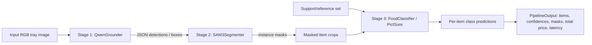

# Architecture

TriFoodNet is a three-stage food-understanding pipeline composed of grounding, segmentation, and few-shot classification. The active training path builds `QwenGrounder`, `SAM3Segmenter`, and `FoodClassifier`, then wires them together through `TriFoodNet`.

## High-Level Data Flow

1. `stage1_qwen.py` encodes the image and prompt, then decodes JSON detections whose only guaranteed field is `box`; labels are optional in the active prompt/parser path.
2. `stage2_sam.py` receives the image tensor plus Stage 1 boxes, predicts prompt-aligned masks, and can optionally run mask NMS.
3. `pipeline.py` turns boxes plus masks into masked crops and forwards them into `stage3_icl.py`.
4. `stage3_icl.py` requires a preloaded support/reference set via `set_support_set()`, then embeds support/query crops through PictSure and returns the best class for each crop.
5. `train_joint.py` computes Stage 1 LM loss, Stage 2 BCE/Dice loss, and Stage 3 classification loss, then combines them with config-controlled weights.

## Model Classes

### `QwenGrounder` in `stage1_qwen.py`
- Inputs: `input_ids`, `attention_mask`, `pixel_values`, `image_grid_thw` during training; a list of PIL images during inference.
- Outputs: HF causal-LM loss during training, or a list of JSON-like detections at inference.
- Parameter count: base Qwen2.5-VL parameters are external and not computed locally; saved LoRA adapter parameters in the best checkpoint: `7,372,800`.
- Notes: optional LoRA targets `q_proj`, `k_proj`, `v_proj`, and `o_proj`; `parse_detections()` validates model-emitted JSON.

### `SAM3Segmenter` in `stage2_sam.py`
- Inputs: image tensor `[B, 3, H, W]` plus prompt boxes per image.
- Outputs: mask predictions, kept query indices, and alignment helpers for prompt-conditioned segmentation.
- Parameter count: saved trainable Stage 2 checkpoint tensors: `2,298,881`.
- Notes: by default only the mask decoder remains trainable; query-to-prompt matching is handled by `_match_queries_to_prompt_boxes()`.

### `FoodClassifier` in `stage3_icl.py`
- Inputs: support images `[B, N*K, 3, 224, 224]`, query images `[B, N*Q, 3, 224, 224]`, and support labels `[B, N*K]`; inference uses masked PIL crops.
- Outputs: logits over exported food classes during training, or top-k class predictions during inference.
- Parameter count: saved trainable Stage 3 checkpoint tensors: `129,531,654`.
- Notes: expands the PictSure classifier head to the dataset class count, optionally applies LoRA to the PictSure transformer, caches support embeddings for repeated inference, and still marks the broader PictSure backbone trainable in the active best-run path. Only `524,288` of the saved Stage 3 parameters are LoRA adapter weights.

### `TriFoodNet` in `pipeline.py`
- Inputs: a collated batch for `forward()` or one PIL image for `run()`.
- Outputs: combined losses during training or a `PipelineOutput` dataclass during inference.
- Parameter count: run logger reported total trainable parameters at startup: `139,203,335`.
- Notes: falls back to Stage 1 boxes if Stage 2 returns no kept masks, saves checkpoints as Stage 1 LoRA + Stage 2/3 tensor bundles, and does not serialize optimizer/scheduler/scaler state in the joint checkpoint path.

### `OfficialPictSureClassifier` in `pictsure_official.py`
- Inputs: a directory-backed reference library or explicit class-to-image mapping, then query crops at inference time.
- Outputs: normalized top-k `(class_name, confidence)` predictions from the upstream public PictSure package.
- Parameter count: loaded from the upstream package at runtime; not part of the retained best-run checkpoint.
- Notes: this is the adapter used for the public upstream path, not the active Stage 3 training implementation from the best run.

### `PictSure` baseline stack in `pictsure_baseline.py`
- Inputs: CLIP-normalized query images plus an embedding index built from labeled reference images.
- Outputs: retrieval-style class predictions based on nearest-neighbor similarity.
- Parameter count: baseline CLIP encoder weights are external and are not part of the retained best-run checkpoint.
- Notes: `CLIPEncoder`, `PictSureIndex`, `PictSureClassifier`, and `PictSurePipeline` are preserved for ablation and legacy comparison work rather than the active training path.

## Mathematical Operations

- Stage 1 optimization uses the Hugging Face language-model loss emitted by Qwen over the box-generation prompt/response sequence.
- Stage 2 optimization combines binary cross-entropy and Dice loss over predicted masks.
- Stage 3 uses `Stage3Loss`, which in the best run is standard cross-entropy with optional label smoothing and logit-adjustment support kept available in code.
- Joint training computes `loss_total = lambda1 * loss_stage1 + lambda2 * loss_stage2 + lambda3 * loss_stage3`.

## Typical Tensor Shapes In The Active Path

- Input image after dataset resize/pad: `[3, 640, 640]` from `cfg.data.image_size`.
- Stage 2 prompt boxes: `[num_items, 4]` in pixel coordinates.
- Stage 2 masks: one binary mask per kept Stage 1 item at image resolution.
- Stage 3 support set for training: `[B, n_way * k_shot, 3, 224, 224]`.
- Stage 3 query set for training: `[B, n_way * query_per_class, 3, 224, 224]`.
- Stage 3 inference crop size: normalized through PictSure preprocessing to `(224, 224)`.
