# TriFoodNet All Trials Report (2026-03-21)

- generated_utc: 2026-03-21T23:14:16.918950+00:00
- runs_compared: 15
- baseline_run: trial-20260321-full3

## Core Metrics

| Run | Status | Best Joint | Best Dev S1 | Best Dev S2 | Best Dev S3 | Min Dev Loss |
| --- | --- | --- | --- | --- | --- | --- |
| trial-20260321-cleandata1 | completed | 1.9376 | 0.863636 | 0.588312 | 0.500000 | 3.1939 |
| trial-20260321-converge4 | failed | - | - | - | - | - |
| trial-20260321-converge5 | unknown | - | - | - | - | - |
| trial-20260321-converge6 | unknown | - | - | - | - | - |
| trial-20260321-converge7 | unknown | 0.818182 | 0.772727 | 0.000000 | 0.045455 | 13.3807 |
| trial-20260321-full3 | completed | 1.9065 | 0.736842 | 0.569656 | 0.600000 | 4.5622 |
| trial-20260321-full40-crossent1 | completed | 1.3521 | 0.772727 | 0.488981 | 0.090909 | 4.0009 |
| trial-20260321-full40-puretf1 | unknown | 1.3102 | 0.772727 | 0.491988 | 0.181818 | 3.7453 |
| trial-20260321-full40-tf08-1 | completed | 1.3971 | 0.772727 | 0.487968 | 0.136364 | 4.1158 |
| trial-20260321-full40-tfmajority1 | completed | - | - | - | - | - |
| trial-20260321-stability1 | unknown | - | - | - | - | - |
| trial-20260321-stability2 | unknown | 0.772727 | 0.772727 | 0.000000 | 0.000000 | 13.0379 |
| trial-20260321-stability3 | completed | 0.818182 | 0.772727 | 0.000000 | 0.045455 | 12.7328 |
| trial-20260321-stability4 | unknown | 1.4443 | 0.772727 | 0.490860 | 0.181818 | 11.0628 |
| trial-20260321-stability5 | completed | 1.4450 | 0.772727 | 0.491058 | 0.181818 | 4.0599 |

## Efficiency And Setup

| Run | Device | Avg Samples/s | Peak GPU GB | Stage 3 Loss | Joint LR | Effective Batch |
| --- | --- | --- | --- | --- | --- | --- |
| trial-20260321-cleandata1 | cuda | 7.1797 | 26.1350 | cross_entropy | 0.000005 | 8.0000 |
| trial-20260321-converge4 | cuda | - | 24.5230 | balanced_softmax | 0.000005 | 8.0000 |
| trial-20260321-converge5 | cuda | 6.5868 | 25.9050 | balanced_softmax | 0.000005 | 8.0000 |
| trial-20260321-converge6 | cuda | 6.8414 | 25.0520 | balanced_softmax | 0.000005 | 8.0000 |
| trial-20260321-converge7 | cuda | 6.7053 | 26.0470 | balanced_softmax | 0.000005 | 8.0000 |
| trial-20260321-full3 | cuda | - | 15.4010 | balanced_softmax | 0.000005 | 1.0000 |
| trial-20260321-full40-crossent1 | cuda | 6.4070 | 26.1330 | cross_entropy | 0.000005 | 8.0000 |
| trial-20260321-full40-puretf1 | cuda | 7.0921 | 26.1280 | cross_entropy | 0.000005 | 8.0000 |
| trial-20260321-full40-tf08-1 | cuda | 5.5701 | 26.0590 | cross_entropy | 0.000005 | 8.0000 |
| trial-20260321-full40-tfmajority1 | cuda | 6.7347 | 26.0630 | cross_entropy | 0.000005 | 8.0000 |
| trial-20260321-stability1 | cuda | 7.6213 | 26.1280 | balanced_softmax | 0.000005 | 8.0000 |
| trial-20260321-stability2 | cuda | 7.2737 | 26.1760 | balanced_softmax | 0.000005 | 8.0000 |
| trial-20260321-stability3 | cuda | 6.9912 | 26.1990 | balanced_softmax | 0.000005 | 8.0000 |
| trial-20260321-stability4 | cuda | 7.0059 | 26.0530 | balanced_softmax | 0.000005 | 8.0000 |
| trial-20260321-stability5 | cuda | 6.4772 | 26.1190 | cross_entropy | 0.000005 | 8.0000 |

## Improvements vs trial-20260321-full3

| Run | Delta Joint | Delta S1 | Delta S2 | Delta S3 |
| --- | --- | --- | --- | --- |
| trial-20260321-cleandata1 | +0.031098 | +0.126794 | +0.018656 | -0.100000 |
| trial-20260321-converge4 | - | - | - | - |
| trial-20260321-converge5 | - | - | - | - |
| trial-20260321-converge6 | - | - | - | - |
| trial-20260321-converge7 | -1.0883 | +0.035885 | -0.569656 | -0.554545 |
| trial-20260321-full3 | 0.000000 | 0.000000 | 0.000000 | 0.000000 |
| trial-20260321-full40-crossent1 | -0.554397 | +0.035885 | -0.080675 | -0.509091 |
| trial-20260321-full40-puretf1 | -0.596329 | +0.035885 | -0.077669 | -0.418182 |
| trial-20260321-full40-tf08-1 | -0.509439 | +0.035885 | -0.081688 | -0.463636 |
| trial-20260321-full40-tfmajority1 | - | - | - | - |
| trial-20260321-stability1 | - | - | - | - |
| trial-20260321-stability2 | -1.1338 | +0.035885 | -0.569656 | -0.600000 |
| trial-20260321-stability3 | -1.0883 | +0.035885 | -0.569656 | -0.554545 |
| trial-20260321-stability4 | -0.462226 | +0.035885 | -0.078797 | -0.418182 |
| trial-20260321-stability5 | -0.461498 | +0.035885 | -0.078598 | -0.418182 |

## Trend Charts

### Train Step Total Loss

Joint training objective over optimizer steps.

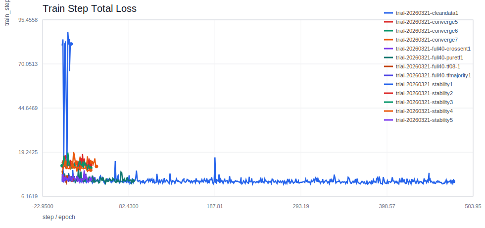

### Train Step Stage 1 Loss

Grounding-language loss during training.

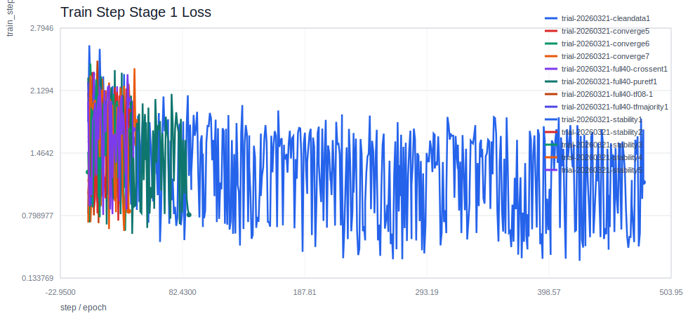

### Train Step Stage 2 Loss

Segmentation loss during training.

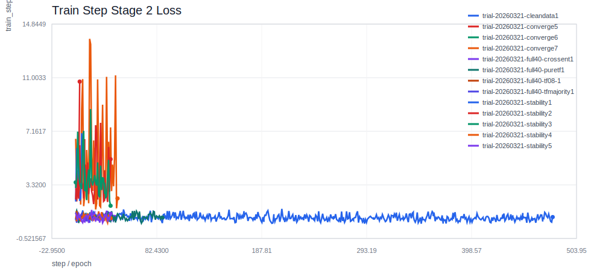

### Train Step Stage 3 Loss

Few-shot classification loss during training.

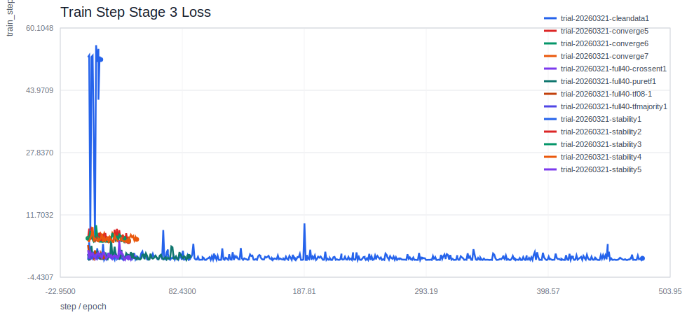

### Train Step Stage 3 Accuracy

Episode-level Stage 3 training accuracy.

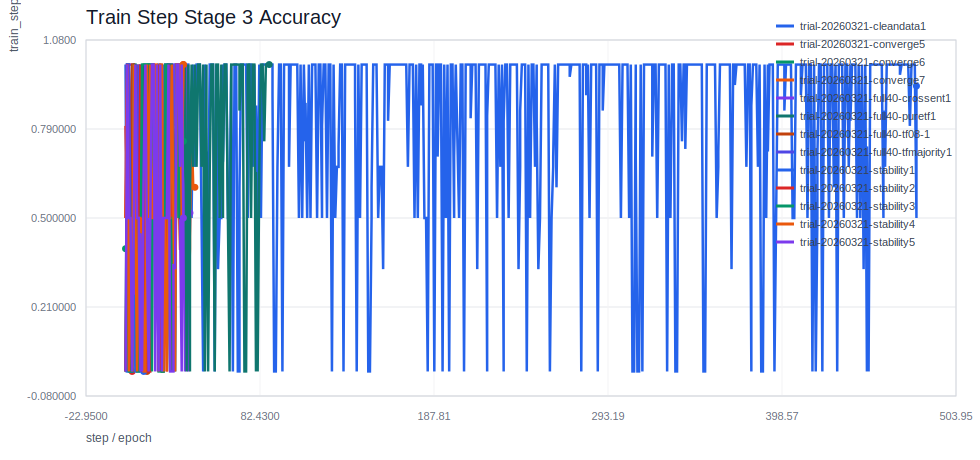

### Train Eval Total Loss

Teacher-forced train-split objective loss for overfitting tracking.

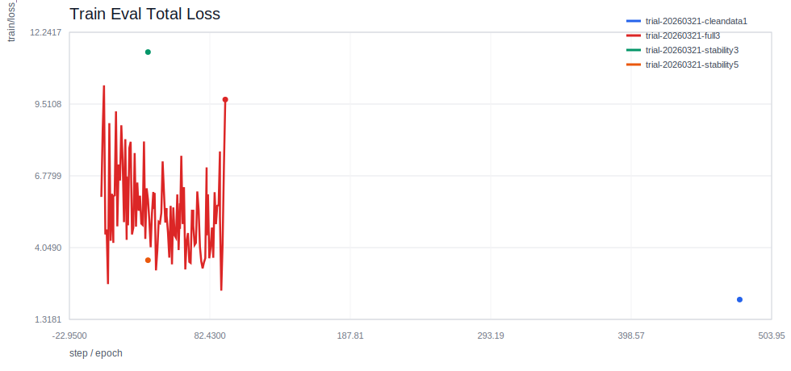

### Train Eval Stage 1 Recall@0.5

Grounding recall against the train split in inference mode.

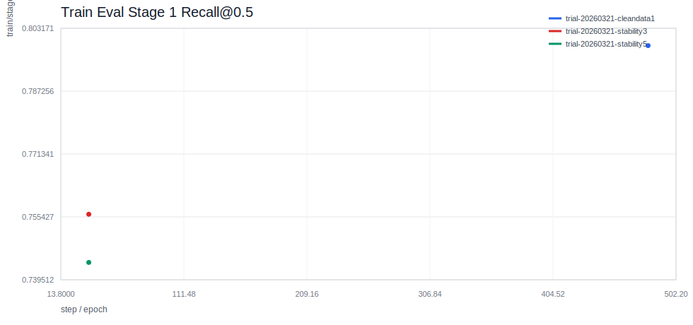

### Train Eval Stage 2 mIoU

End-to-end segmentation quality using Qwen-prompted SAM3 masks on the train split.

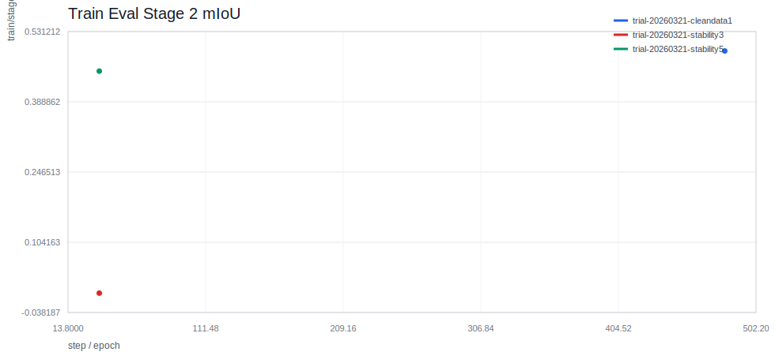

### Train Eval Stage 3 Accuracy

End-to-end item classification accuracy against the train split.

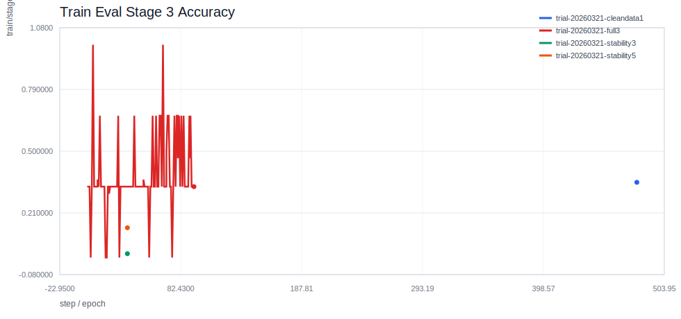

### Train Eval Stage 3 Matched Accuracy

Classification accuracy on train items whose predicted boxes matched ground truth.

### Train Eval Stage 3 Episode Accuracy

Teacher-forced PictSure ICL episode accuracy on train masked crops.

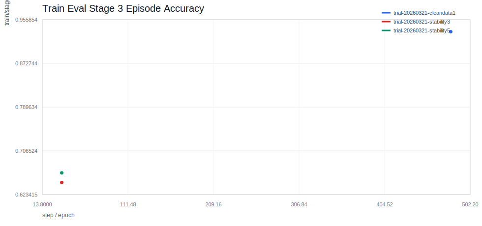

### Dev Total Loss

Teacher-forced dev objective loss for overfitting tracking.

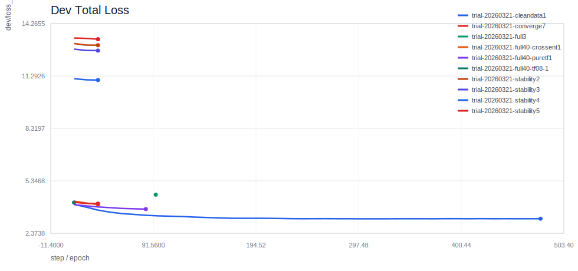

### Dev Stage 1 Recall@0.5

Grounding recall against the held-out dev split.

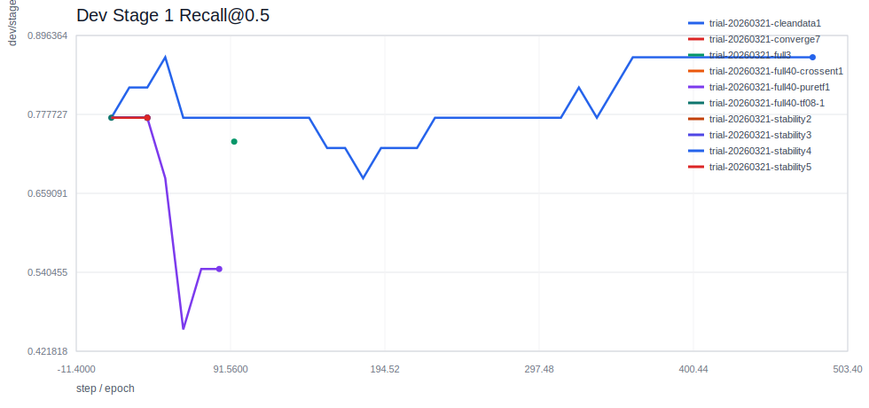

### Dev Stage 2 mIoU

End-to-end segmentation quality using Qwen-prompted SAM3 masks on the held-out dev split.

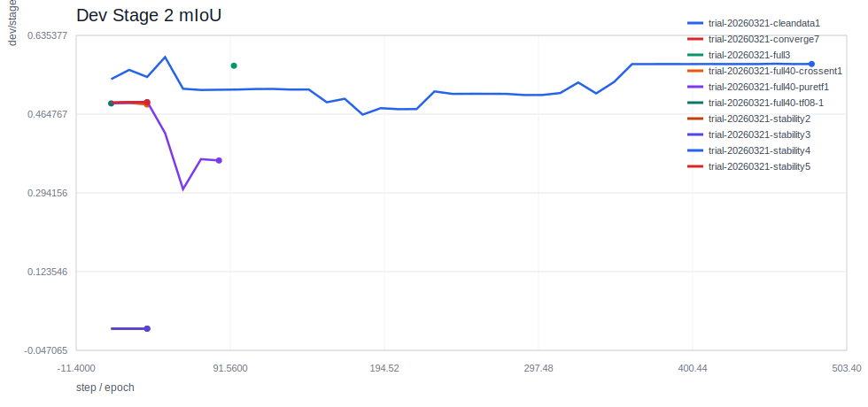

### Dev Stage 3 Accuracy

End-to-end item classification accuracy against the held-out dev split.

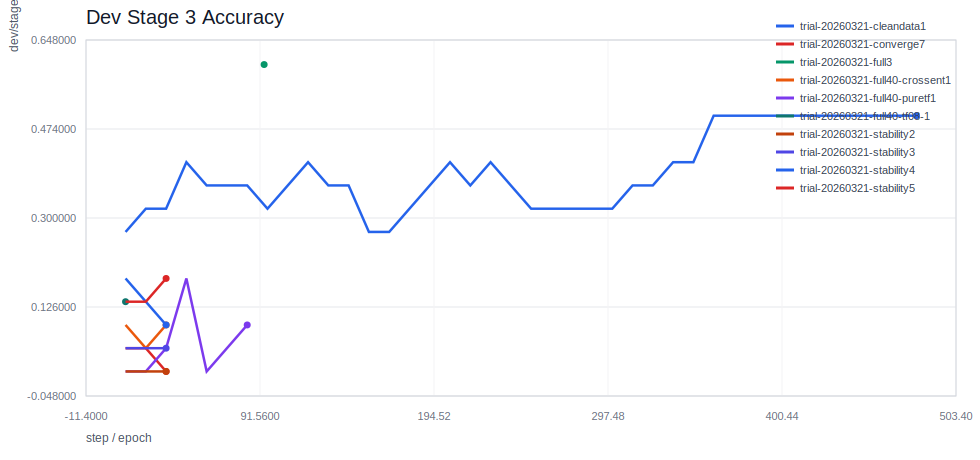

### Dev Stage 3 Matched Accuracy

Classification accuracy on dev items whose predicted boxes matched ground truth.

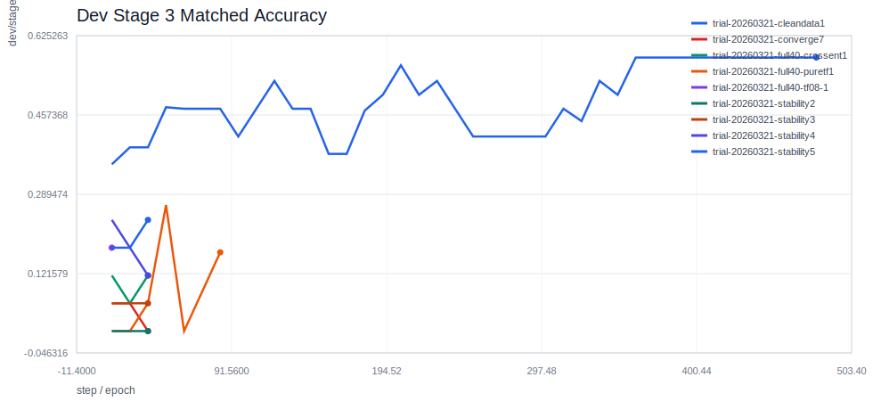

### Dev Stage 3 Episode Accuracy

Teacher-forced PictSure ICL episode accuracy on held-out dev masked crops.

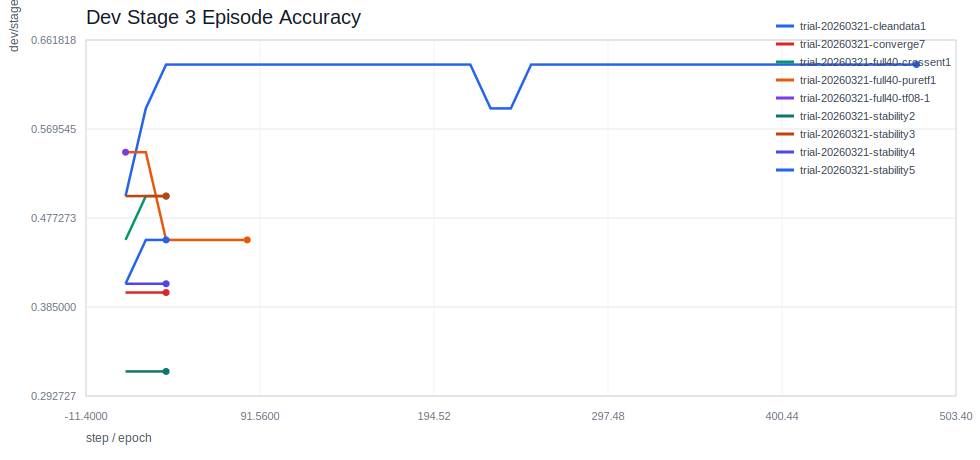

### Dev Inference Latency

Average end-to-end dev-image latency in milliseconds.

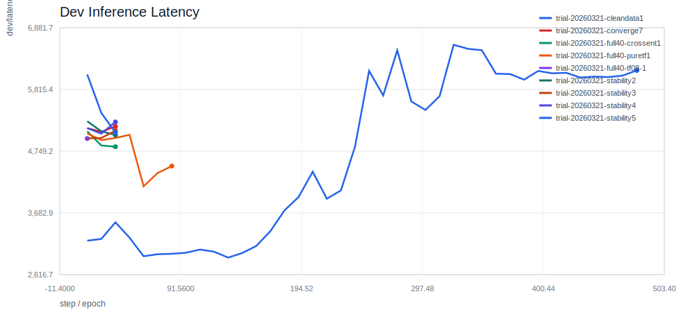

### Learning Rate

Optimizer learning rate progression.

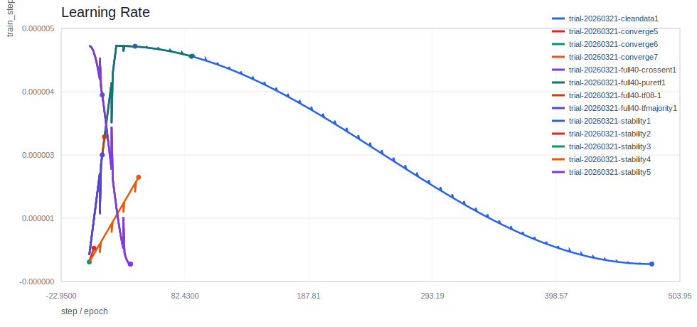

### Training Throughput

Measured samples processed per second.

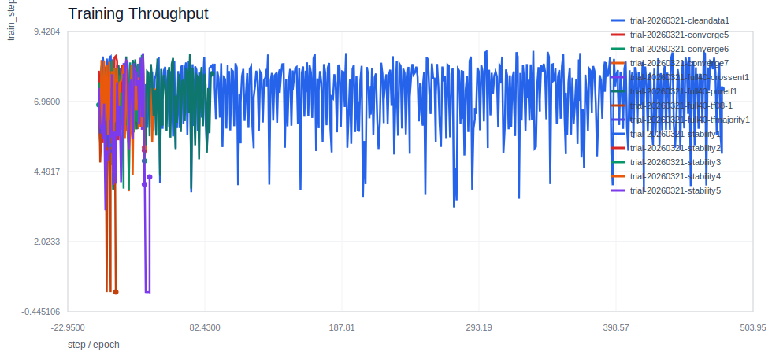

### Peak GPU Memory

Peak allocated GPU memory per logged event.

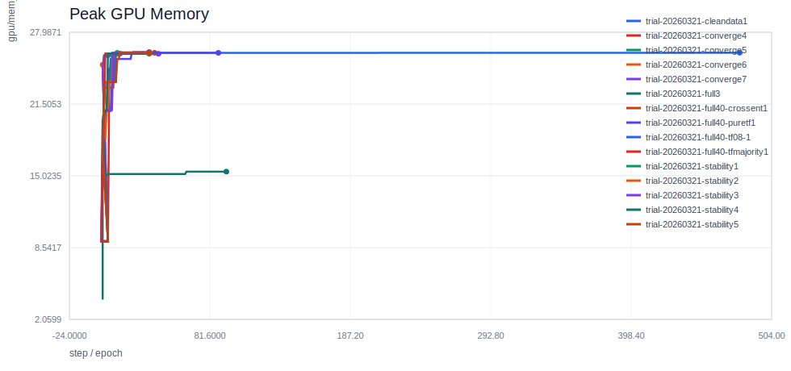

## Best-Score Comparison

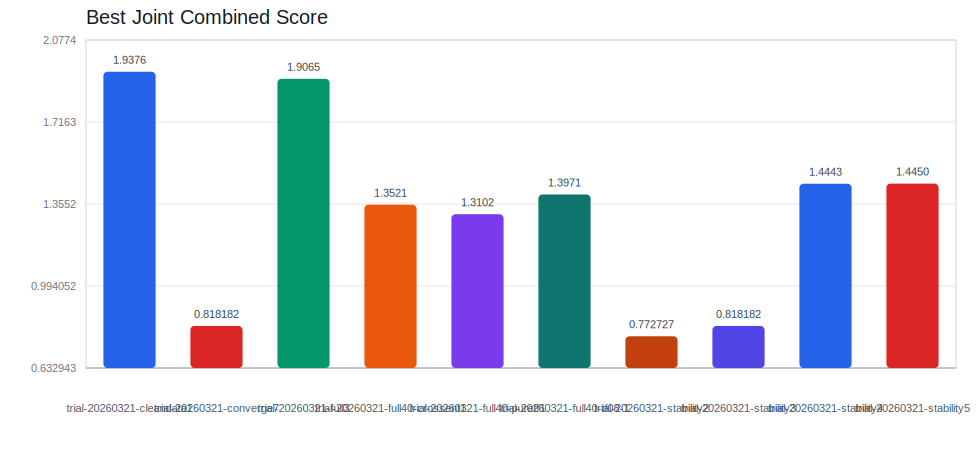

## Baseline Delta Chart

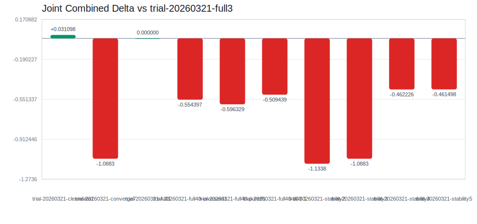

## Run Cards

- [trial-20260321-cleandata1](runs/trial-20260321-cleandata1.md)
- [trial-20260321-converge4](runs/trial-20260321-converge4.md)
- [trial-20260321-converge5](runs/trial-20260321-converge5.md)
- [trial-20260321-converge6](runs/trial-20260321-converge6.md)
- [trial-20260321-converge7](runs/trial-20260321-converge7.md)
- [trial-20260321-full3](runs/trial-20260321-full3.md)
- [trial-20260321-full40-crossent1](runs/trial-20260321-full40-crossent1.md)
- [trial-20260321-full40-puretf1](runs/trial-20260321-full40-puretf1.md)
- [trial-20260321-full40-tf08-1](runs/trial-20260321-full40-tf08-1.md)
- [trial-20260321-full40-tfmajority1](runs/trial-20260321-full40-tfmajority1.md)
- [trial-20260321-stability1](runs/trial-20260321-stability1.md)
- [trial-20260321-stability2](runs/trial-20260321-stability2.md)
- [trial-20260321-stability3](runs/trial-20260321-stability3.md)
- [trial-20260321-stability4](runs/trial-20260321-stability4.md)
- [trial-20260321-stability5](runs/trial-20260321-stability5.md)
