# TriFoodNet Train/Dev Report: trial-20260321-cleandata1

- generated_utc: 2026-03-21T23:02:15.149827+00:00
- runs_compared: 1
- baseline_run: trial-20260321-cleandata1

## Core Metrics

| Run | Status | Best Joint | Best Dev S1 | Best Dev S2 | Best Dev S3 | Min Dev Loss |
| --- | --- | --- | --- | --- | --- | --- |
| trial-20260321-cleandata1 | completed | 1.9376 | 0.863636 | 0.588312 | 0.500000 | 3.1939 |

## Efficiency And Setup

| Run | Device | Avg Samples/s | Peak GPU GB | Stage 3 Loss | Joint LR | Effective Batch |
| --- | --- | --- | --- | --- | --- | --- |
| trial-20260321-cleandata1 | cuda | 7.1797 | 26.1350 | cross_entropy | 0.000005 | 8.0000 |

## Improvements vs trial-20260321-cleandata1

| Run | Delta Joint | Delta S1 | Delta S2 | Delta S3 |
| --- | --- | --- | --- | --- |
| trial-20260321-cleandata1 | 0.000000 | 0.000000 | 0.000000 | 0.000000 |

## Trend Charts

### Train Step Total Loss

Joint training objective over optimizer steps.

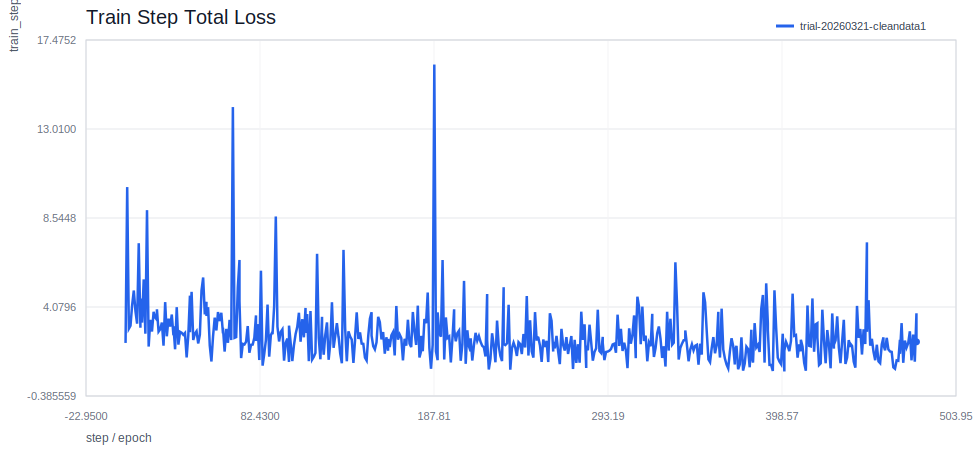

### Train Step Stage 1 Loss

Grounding-language loss during training.

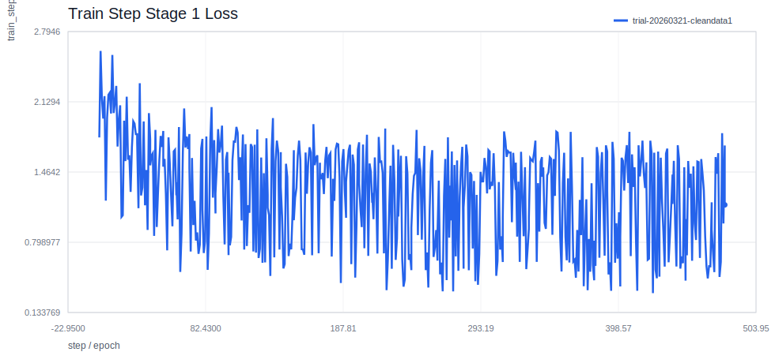

### Train Step Stage 2 Loss

Segmentation loss during training.

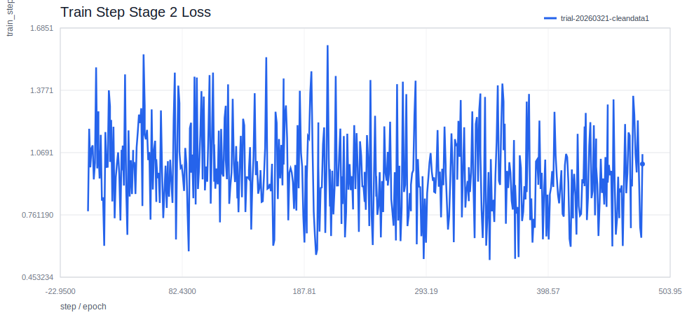

### Train Step Stage 3 Loss

Few-shot classification loss during training.

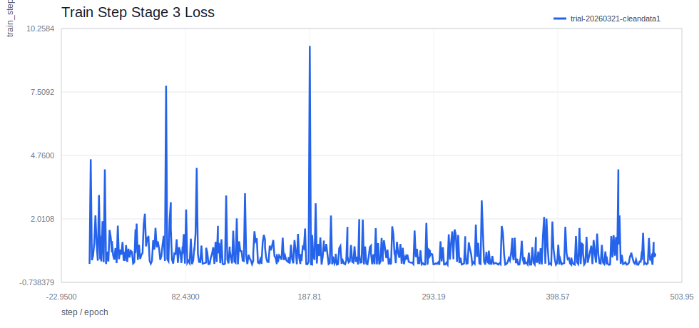

### Train Step Stage 3 Accuracy

Episode-level Stage 3 training accuracy.

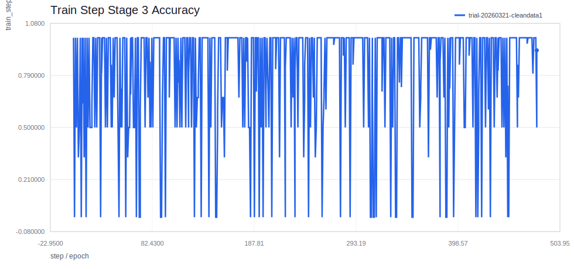

### Train Eval Total Loss

Teacher-forced train-split objective loss for overfitting tracking.

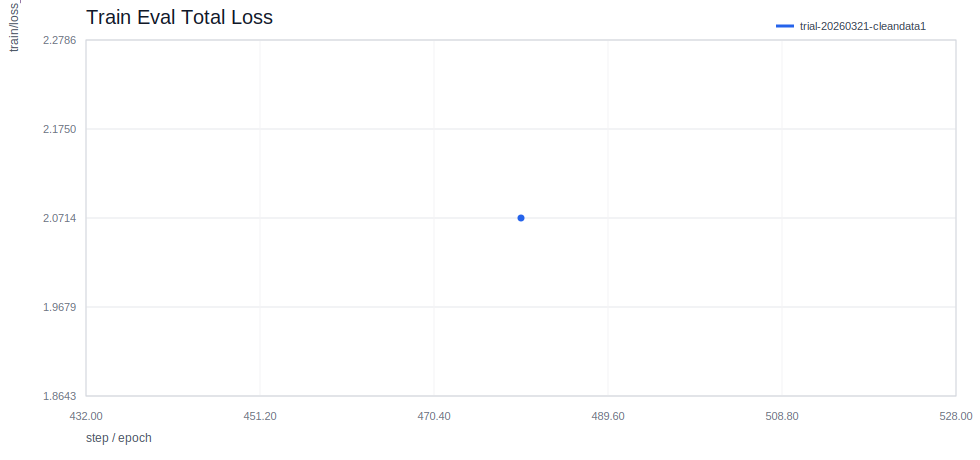

### Train Eval Stage 1 Recall@0.5

Grounding recall against the train split in inference mode.

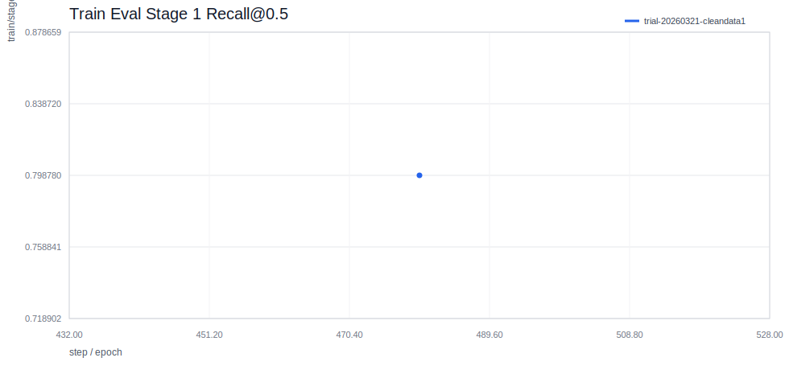

### Train Eval Stage 2 mIoU

End-to-end segmentation quality using Qwen-prompted SAM3 masks on the train split.

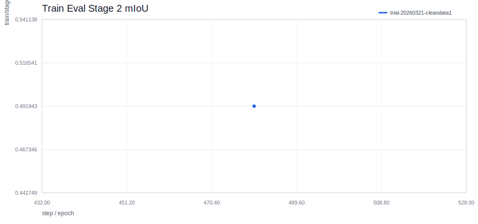

### Train Eval Stage 3 Accuracy

End-to-end item classification accuracy against the train split.

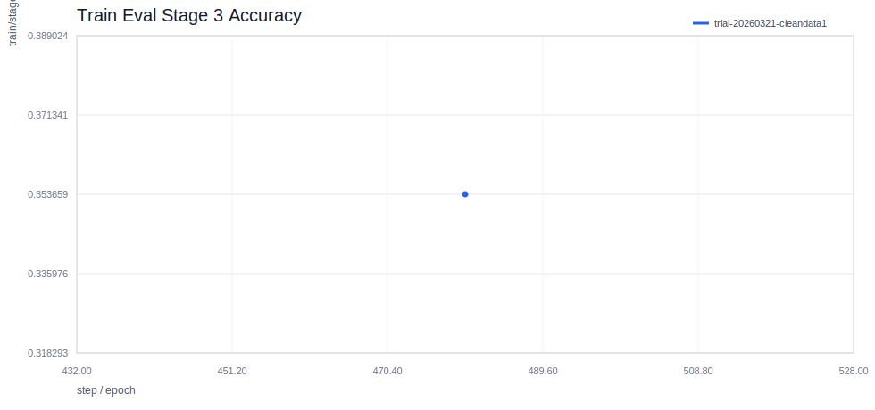

### Train Eval Stage 3 Matched Accuracy

Classification accuracy on train items whose predicted boxes matched ground truth.

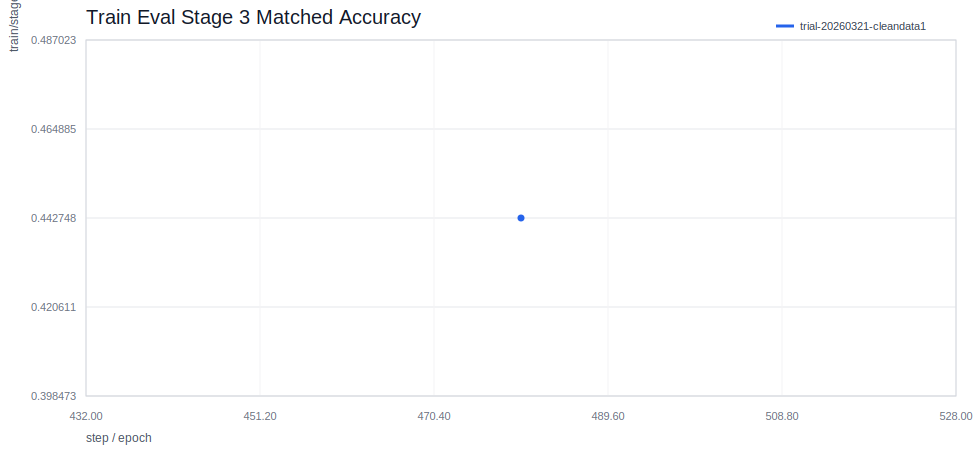

### Train Eval Stage 3 Episode Accuracy

Teacher-forced PictSure ICL episode accuracy on train masked crops.

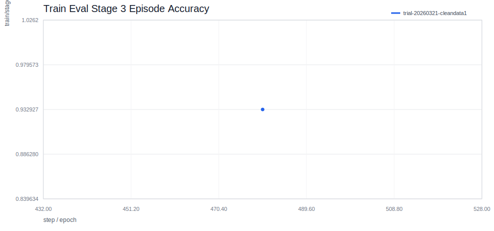

### Dev Total Loss

Teacher-forced dev objective loss for overfitting tracking.

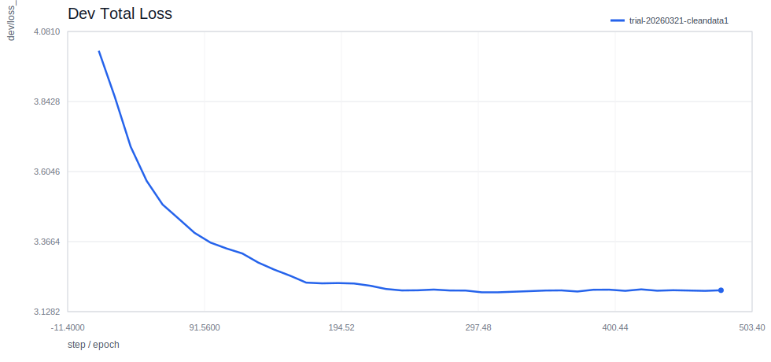

### Dev Stage 1 Recall@0.5

Grounding recall against the held-out dev split.

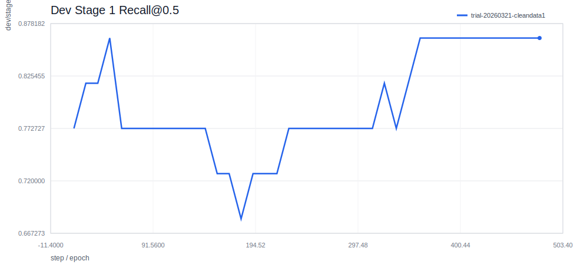

### Dev Stage 2 mIoU

End-to-end segmentation quality using Qwen-prompted SAM3 masks on the held-out dev split.

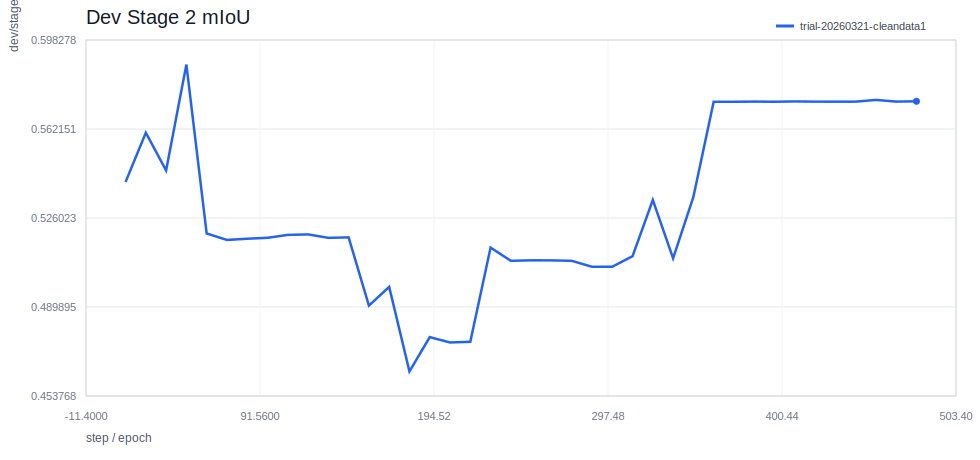

### Dev Stage 3 Accuracy

End-to-end item classification accuracy against the held-out dev split.

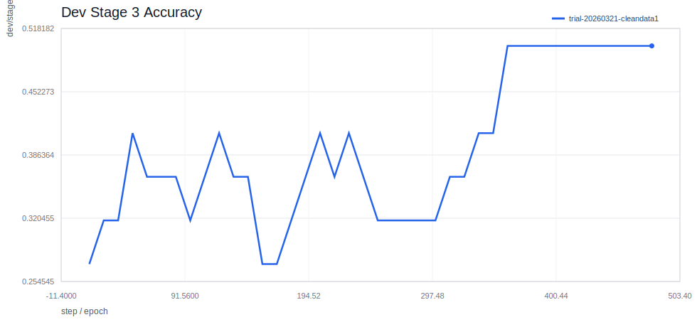

### Dev Stage 3 Matched Accuracy

Classification accuracy on dev items whose predicted boxes matched ground truth.

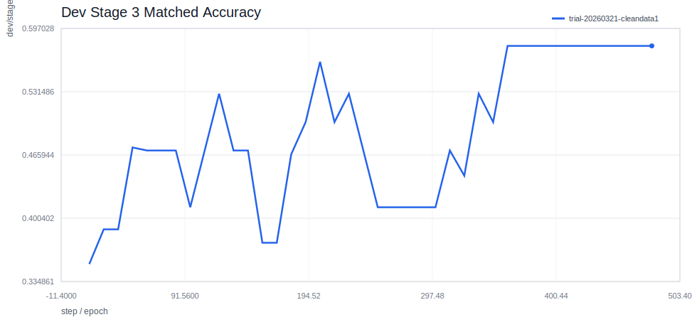

### Dev Stage 3 Episode Accuracy

Teacher-forced PictSure ICL episode accuracy on held-out dev masked crops.

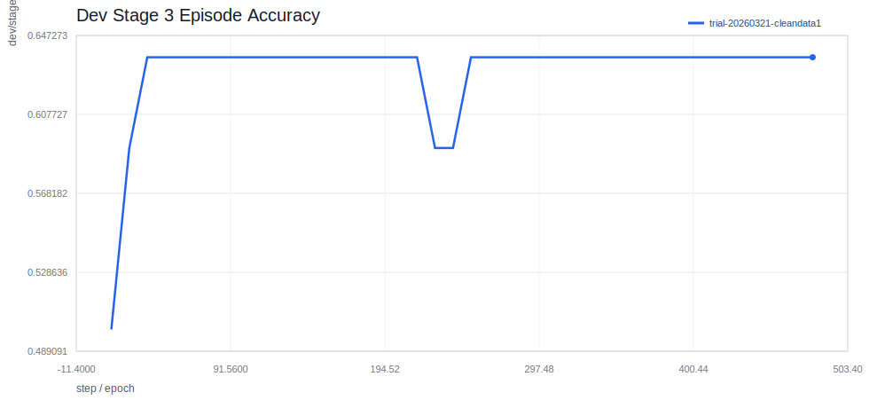

### Dev Inference Latency

Average end-to-end dev-image latency in milliseconds.

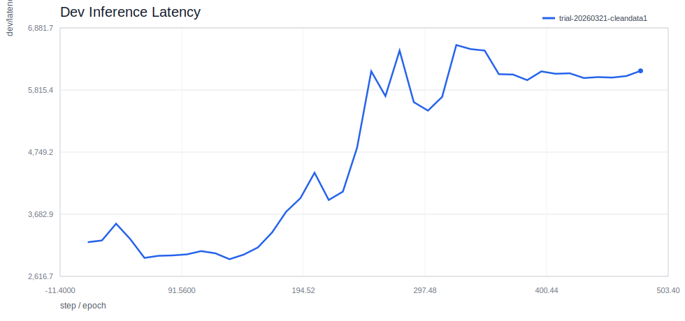

### Learning Rate

Optimizer learning rate progression.

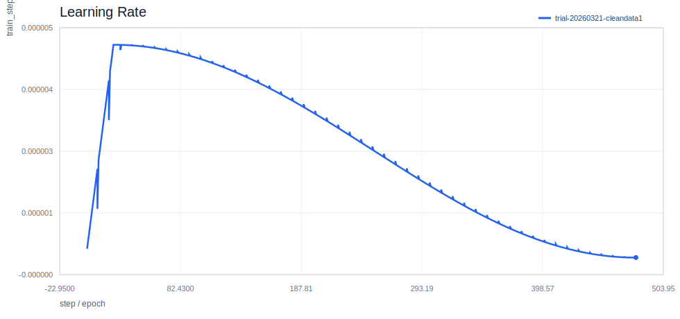

### Training Throughput

Measured samples processed per second.

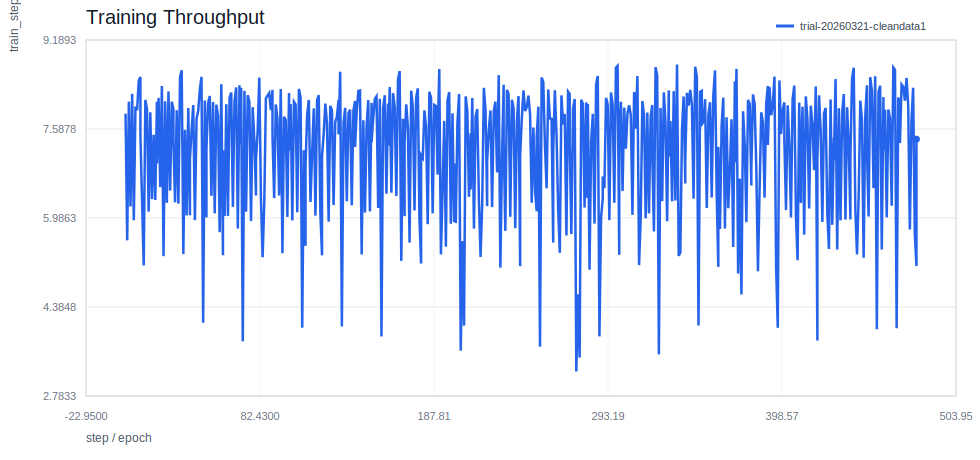

### Peak GPU Memory

Peak allocated GPU memory per logged event.

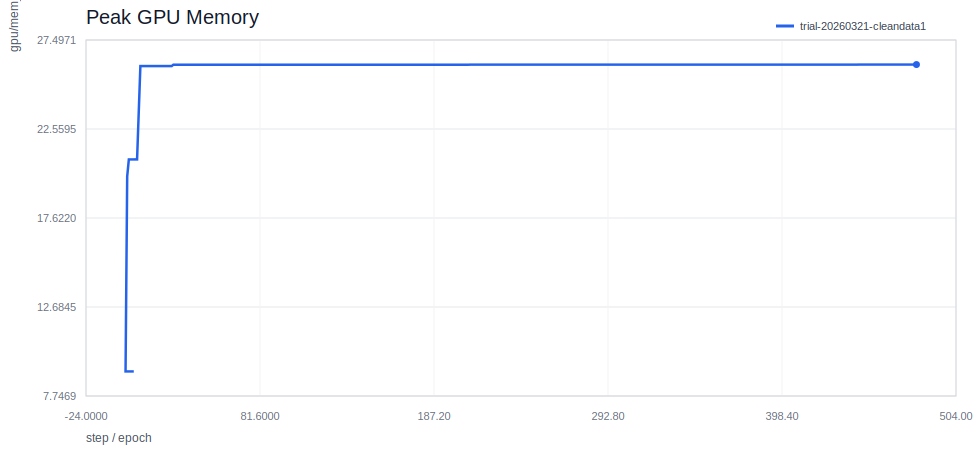

## Best-Score Comparison

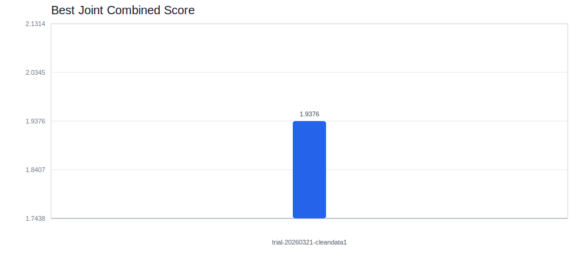

## Baseline Delta Chart

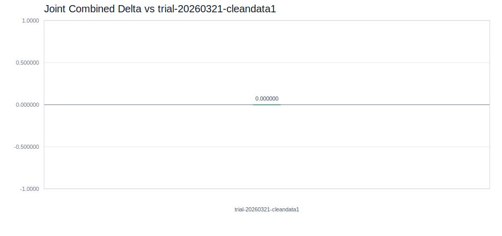

## Run Cards

- [trial-20260321-cleandata1](runs/trial-20260321-cleandata1.md)
