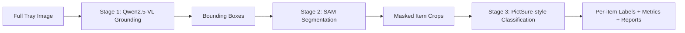

# TriFoodNet Research Snapshot for PhD Review

TriFoodNet is a three-stage food-understanding pipeline for cafeteria-tray
images. It combines multimodal grounding, prompt-conditioned segmentation, and
masked-item classification into one end-to-end research workflow. This proposal
copy is organized for faculty review: the code, retained experiment evidence,
best packaged checkpoint, and supporting documentation are grouped so a reviewer
can assess novelty, technical coherence, empirical quality, and reproducibility
without reconstructing the project history manually.

## Relationship to `KFUPMRestaurant`

This repository should be read as a research-focused companion to the public
showcase repository:

- `https://github.com/AbdullahMadoun/KFUPMRestaurant`

Based on the public `KFUPMRestaurant` README, that repo presents the broader
project evolution from an earlier FoodSAM + PictSure pipeline to a later
Qwen2.5-VL + SAM3 inference pipeline. This repository is narrower and more
research-oriented: it keeps the active three-stage training code, experiment
logs, report outputs, validation evidence, and retained checkpoint artifacts
behind that line of work.

Practical distinction:

- `KFUPMRestaurant` is the public showcase and high-level lineage repo.
- This repo is the research snapshot intended for deeper technical assessment.

Public GitHub packaging note:

- this copy keeps the research code, logs, reports, and documentation
- the heavyweight `weights/best_checkpoint.tar` artifact is not included in this
  public tree to keep the repository pushable and easy to review
- checkpoint provenance is still preserved in `weights/CHECKPOINT_PROVENANCE.md`

## At A Glance

| Item | Value |
| --- | --- |
| Snapshot packaging date | 2026-03-30 |
| Strongest retained run | `trial-20260321-cleandata1` |
| Best retained checkpoint | `epoch_038` by `joint/combined = 1.9375961198969618` |
| Final retained epoch | `epoch_040` |
| Final dev Stage 1 recall@0.5 | `0.8636363636363636` |
| Final dev Stage 2 mIoU | `0.5733921838932934` |
| Final dev Stage 3 accuracy | `0.5` |
| Final dev combined score | `1.937028547529657` |
| Runs compared in retained report | `15` |
| Packaged checkpoint integrity | validated in `VALIDATION_REPORT.md` |
| Fully bundled dataset | `No` |
| True optimizer-state resume | `No` |

## Research Objective

The core research question is whether a staged pipeline can separate three
different reasoning burdens more cleanly than a single monolithic model:

1. detect food instances in a full tray scene,
2. convert those detections into accurate item masks,
3. classify the masked crops with a specialist item recognizer.

The design goal is not just higher accuracy on one subtask. It is to preserve
interpretability across the chain:

- Stage 1 explains what was detected,
- Stage 2 explains exactly where each item is,
- Stage 3 explains what the cropped and masked item most likely is.

That decomposition matters for real-world cafeteria or food-service settings,
where mixed trays, occlusion, and visually similar dishes make end-to-end error
analysis difficult if everything is compressed into one opaque prediction.

## Architecture



Stage responsibilities:

- `stage1_qwen.py`: grounding with Qwen2.5-VL and LoRA support
- `stage2_sam.py`: segmentation from Stage 1 boxes
- `stage3_icl.py`: masked-item classification using a PictSure-style path
- `pipeline.py`: end-to-end orchestration across all three stages

## Latest Retained Results

The strongest retained run in this snapshot is `trial-20260321-cleandata1`.
Two different checkpoints matter:

- best end-to-end checkpoint: `epoch_038`, selected by `joint/combined`
- latest retained checkpoint: `epoch_040`

### Best Retained Checkpoint

| Metric | Value |
| --- | --- |
| Run | `trial-20260321-cleandata1` |
| Selection rule | strongest `joint/combined` |
| Best epoch | `38` |
| Best combined score | `1.9375961198969618` |

### Final Retained Dev Metrics at Epoch 40

| Metric | Value |
| --- | --- |
| `dev/loss_total` | `3.20090651512146` |
| `dev/stage1_precision@0.5` | `0.76` |
| `dev/stage1_recall@0.5` | `0.8636363636363636` |
| `dev/stage2_mIoU` | `0.5733921838932934` |
| `dev/stage3_acc` | `0.5` |
| `dev/stage3_matched_acc` | `0.5789473684210527` |
| `dev/stage3_episode_acc` | `0.6363636363636364` |
| `dev/pred_items_per_image` | `2.0833333333333335` |
| `dev/latency_total_ms` | `6144.5216666666665` |
| `dev/combined` | `1.937028547529657` |

### Comparison Story Across Retained Runs

This is the most defensible summary of the retained experiment arc:

- `trial-20260321-full3` achieved the strongest retained `dev/stage3_acc = 0.6`
  but lower end-to-end `best_joint_combined = 1.9065`.
- `trial-20260321-cleandata1` improved the end-to-end combined score to
  `1.9376`, mainly by improving Stage 1 and Stage 2 behavior after data repair.
- `trial-20260321-stability4` and `trial-20260321-stability5` clustered around
  `1.444`, showing partial recovery but not strong end-to-end performance.
- `trial-20260321-full40-crossent1`, `trial-20260321-full40-puretf1`, and
  `trial-20260321-full40-tf08-1` stayed well below the best run.
- `trial-20260321-converge7` collapsed at Stage 2 and is useful mainly as a
  failure case.

### Evidence Links

- Full multi-run report: `outputs/all_trials_report_20260321/index.md`
- Best-run summary: `outputs/trial-20260321-cleandata1/report_metrics/RESULTS_SUMMARY.md`
- Best-checkpoint provenance: `weights/CHECKPOINT_PROVENANCE.md`
- Packaged validation evidence: `VALIDATION_REPORT.md`

## Why This Repo May Be Worth Assessing

From a research assessment perspective, the value of this repo is not only the
headline score. It also preserves the evidence needed to judge whether the work
is technically serious:

- clear modular decomposition across grounding, segmentation, and classification
- retained logs for multiple unsuccessful and partially successful runs
- packaged best-checkpoint provenance
- explicit validation and resume guides
- preserved outputs that make error analysis possible after the fact

This makes it possible to assess the work on four axes:

1. technical originality of the staged design,
2. quality of engineering and experiment tracking,
3. credibility of the retained empirical evidence,
4. reproducibility gaps that would need to be closed for publication.

## What Is Included

- root source files for training, inference, reporting, and validation
- `tests/` for lightweight checks
- `master_config.yaml` and package metadata
- bundled `pictsure_library/`
- retained `logs/` and `outputs/`
- checkpoint provenance at `weights/CHECKPOINT_PROVENANCE.md`
- checkpoint metadata under `checkpoints/`
- detailed project and experiment documentation
- representative `batch8` input examples under `../../assets/v3/batch8_samples/`

## What Is Not Included

- reviewed export dataset
- `Sampled_Images_All/`
- exact optimizer, scheduler, and scaler resume state
- a fully locked environment file for exact long-term replay
- the large packaged checkpoint tarball in this public GitHub copy

This limitation should be stated plainly: the repo is strong enough for code
review, methodology review, weight-based warm starts, and evidence inspection,
but it is not a fully self-contained benchmark release.

## Batch8 Source Images

The main V3 MVP image package came from the `batch_results_v8_500` export inside
the `v3_3stage_mvp` workspace. That package recorded:

- `500` total images
- `467` successful processed cases
- per-case folders containing `original.jpg`, `visualization.jpg`, crops, masks,
  and JSON outputs

This public repo includes representative examples only:

- `../../assets/v3/batch8_samples/`

The public sample folders are intended to show what the real inputs and outputs
look like without copying the entire raw package into Git.

## Reproducibility And Reuse

### Environment Setup

```bash
python -m venv .venv
. .venv/bin/activate
pip install -e ./pictsure_library
pip install -e ".[research,dev]"
```

On Windows PowerShell:

```powershell
python -m venv .venv
.venv\Scripts\Activate.ps1
pip install -e .\pictsure_library
pip install -e ".[research,dev]"
```

### Restore The Packaged Checkpoint

Linux/macOS:

```bash
./restore_best_checkpoint.sh
```

Windows PowerShell:

```powershell
.\restore_best_checkpoint.ps1
```

If you need the actual tarball used by those restore scripts, it should be kept
as a separate archival artifact rather than assumed to exist in this public Git
copy.

### Configure Dataset Paths

Update `master_config.yaml` before running validation or training:

```yaml
data:
  integration:
    batch_root: "PATH_TO_BATCH_ROOT"
    export_root: ""
    repo_root: "PATH_TO_DIRECTORY_WITH_Sampled_Images_All"
```

### Run A Small Validation Pass

```bash
python validate_pipeline_contracts.py \
  --config ./master_config.yaml \
  --run-name trial-20260321-cleandata1 \
  --split dev \
  --max-images 5 \
  --output ./validation_report.local.json
```

## Limitations

These are the main limitations a reviewer should keep in mind:

- the snapshot is not a full paper-release package
- dataset assets are external and must be restored separately
- the packaged checkpoint is weight-only, not a true optimizer-state resume
- `master_config.yaml` still reflects the original Linux training layout
- some historical runs are incomplete or failed, although they remain useful as
  evidence of the experiment path

## Suggested Faculty Review Path

If the goal is to evaluate this work efficiently, this is the recommended order:

1. read this `README.md`
2. read `docs/FACULTY_REVIEW_GUIDE.md`
3. inspect `ARCHITECTURE.md`
4. inspect `outputs/all_trials_report_20260321/index.md`
5. inspect `outputs/trial-20260321-cleandata1/report_metrics/RESULTS_SUMMARY.md`
6. inspect `VALIDATION_REPORT.md`
7. inspect `TRAINING_GUIDE.md` and `DATA_PIPELINE.md`

## Repository Navigation

- `docs/README.md`: documentation hub
- `docs/FACULTY_REVIEW_GUIDE.md`: assessment-oriented review path
- `docs/REPOSITORY_MAP.md`: where everything lives
- `RESUME_GUIDE.md`: operational resume notes
- `TRAINING_GUIDE.md`: checkpoint and training semantics
- `DATA_PIPELINE.md`: data contract and pointer-image behavior
- `EVAL_GUIDE.md`: evaluation framing
- `EXPERIMENTS_INDEX.md`: retained run inventory
- `VALIDATION_REPORT.md`: packaged validation evidence

## GitHub Publishing Note

This proposal copy is trimmed for public browsing and review. The large
checkpoint tarball was intentionally left out of this GitHub copy; if you later
decide to publish it, use Git LFS or a release asset rather than a normal Git
blob. See `docs/GITHUB_PUBLISHING.md`.
